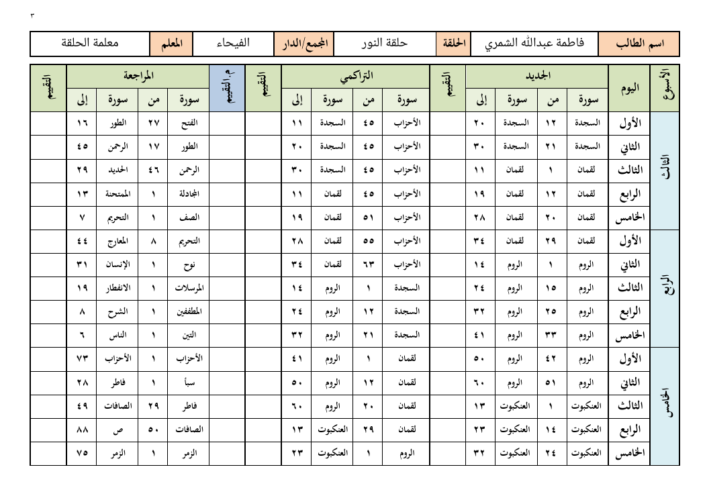
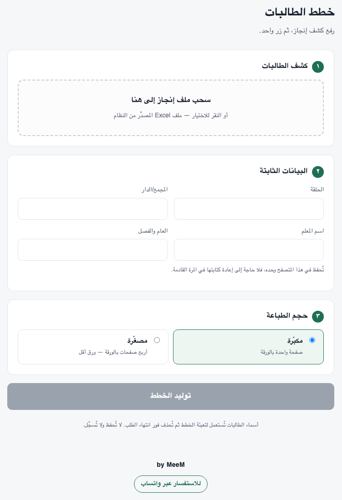

<div dir="rtl">

# خُطط

**تعبئة خطط حلقات التحفيظ آليًّا من كشف الطالبات.**

ترفع المعلمة كشف طالباتها المصدَّر من نظام إنجاز، فتحصل على خطة يومية جاهزة للطباعة لكل طالبة: قالب منهجها ومستواها الصحيح، وترويسة معبّأة باسمها وحلقتها ودارها ومعلمتها.



<sub>الأسماء في الصور مخترعة.</sub>

---

## المشكلة

تنشر الجمعية الخيرية لتحفيظ القرآن الكريم بعنيزة خططها اليومية قوالبَ PDF بترويسة فارغة. وفي بداية كل فصل تبحث المعلمة عن قالب كل طالبة بحسب منهجها ومستواها، ثم تعبّئ ترويسته بخط اليد، طالبةً طالبة.

في حلقة من سبع عشرة طالبة، هذا يعني سبعة قوالب مختلفة وسبع عشرة ترويسة تُكتب يدويًّا — كل فصل.

## ما تفعله الأداة

1. **تقرأ كشف إنجاز** وتستخرج اسم كل طالبة ورمز خطتها (`4 - 3` = المستوى الرابع من المنهج الثالث).
2. **تجلب القالب المناسب** من موقع الجمعية نفسه، وتحفظه فلا يُنزَّل مرتين.
3. **تكتشف خانات الترويسة** داخل القالب دون أي إحداثيات مكتوبة مسبقًا.
4. **تكتب القيم** بخط عربي سليم الوصل والاتجاه، وتصغّر الاسم الطويل ليتّسع لخانته.
5. **تطبع مكبّرة أو مصغّرة** — صفحة بالورقة، أو أربع صفحات بالورقة.

والطالبة التي لا يتوفر قالب رقمي لخطتها لا تُتخطّى بصمت: **تُذكر باسمها وسبب تعذّرها**، كي لا تكتشف المعلمة النقص أمام طالباتها.



---

## التشغيل

يتطلب Python 3.12 أو أحدث.

```bash
python3 -m venv .venv
.venv/bin/python -m pip install -e .
```

### الصفحة — للمعلمات

```bash
.venv/bin/python -m khutat.web
```

تفتح الصفحة في المتصفح تلقائيًّا. وعلى macOS يكفي الضغط المزدوج على ملف `خطط الطالبات.command`.

### سطر الأوامر

```bash
.venv/bin/python -m khutat.roster roster.xlsx out/plans \
  --font assets/fonts/NotoNaskhArabic-Regular.ttf \
  --size compact \
  --set "الحلقة=حلقة النور" \
  --set "اسم المعلم=نورة القحطاني"
```

| الأمر | ما يفعله |
|---|---|
| `khutat.roster ... --list` | يعرض الطالبات ومناهجهن دون توليد شيء |
| `khutat.catalogue --refresh` | يعيد فهرسة مصادر القوالب |
| `khutat.catalogue --get 1 4` | ينزّل قالبًا واحدًا (منهج ١، مستوى ٤) |
| `khutat.templates DIR --overlay OUT` | يرسم الخانات المكتشفة فوق كل قالب للفحص البصري |

### الإعدادات

| المتغيّر | الغرض |
|---|---|
| `KHUTAT_DRIVE_FOLDER` | مجلد العمل الذي يحوي خطط المنهج السادس. اختياري؛ بدونه يُعتمد الموقع العام وحده |
| `KHUTAT_WHATSAPP` | رقم زر الاستفسار في الصفحة |
| `KHUTAT_CREDIT` | التوقيع أسفل الصفحة |

محليًّا تُكتب في ملف `.env` (متجاهَل في Git). والنشر على [Render](https://render.com) معرَّف في `render.yaml`.

---

## كيف تعمل

```
roster.py        قراءة كشف إنجاز
  └ catalogue.py     إيجاد قالب كل طالبة وتنزيله
    └ imposition.py      توحيد القالب: صفحة منطقية لكل صفحة
      └ detect.py            اكتشاف خانات الترويسة
        └ fill.py                كتابة القيم
          └ imposition.py            تركيب مصغّر (اختياري)
```

## ثلاث مسائل لم تكن بسيطة

### ١ · الإحداثيات بلا مصفوفة التحويل لا تعني شيئًا

يُرسم كل مستطيل في PDF داخل فضاء تحدّده مصفوفة التحويل السارية لحظتها. قوالب الجمعية لا تستعمل أي مصفوفة، فكانت قراءة الأرقام مباشرة تعمل مصادفةً. لكن القالب المحوَّل من Word يقلب المحور الرأسي ويصغّر بمعامل ٠٫٧٥ عبر مئتي مصفوفة، فتسقط كل خانة في غير مكانها ولا يُكتشف شيء.

لذلك يمشي الكاشف في مجرى المحتوى خطوةً خطوة، ويتتبّع `q` و`Q` و`cm`، ويحوّل أركان كل مستطيل قبل أن يعدّه خانة، ويدخل النماذج المتداخلة عبر مصفوفاتها الخاصة.

### ٢ · العربية تحتاج ثلاث معالجات منفصلة

- **الوصل:** للحرف العربي حتى أربع صور، ومكتبة الرسم لا تختار بينها، فتخرج الحروف منفصلة دون `arabic-reshaper`.
- **الاتجاه:** حتى بعد الوصل تُرصّ الحروف من اليسار، فتلزم خوارزمية ثنائية الاتجاه — مع بقاء الأرقام واللاتينية بترتيبها.
- **المطابقة:** بعض البرامج تخزّن النص بصوره المشكَّلة (`اﺳم اﻟطﺎﻟب`) لا بحروفه المجرّدة، فلا يطابق «اسم الطالب» إلا بعد توحيد NFKC.

وأي عملية على النص — قصّ أو تنظيف — يجب أن تسبق التشكيل. قصّ النص بعد تشكيله يحذف **أول** الاسم لا آخره.

### ٣ · الاكتشاف بالهندسة لا بالإحداثيات

لا توجد في القوالب حقول نماذج؛ الترويسة جدول مرسوم. فتُعرف كل خانة بموضع تسميتها: يُعثر على «اسم الطالب» نصًّا، ثم على الخلية المرسومة التي تحويها، ثم على الخلية الفارغة إلى يسارها.

ولأن الخلايا تتداخل — تسمية أعرض من عمودها تُلفّ على سطرين في خليتين متراكبتين — يُحتسب النص لكل خلية تحويه، وتُجرَّب الأضيق أولًا. والخلية التي عبّأتها الجمعية مسبقًا تُترك كما هي.

والنتيجة: الكود نفسه يعمل على مكتبة القوالب كلها دون أي ضبط لكل ملف.

---

## مصادر القوالب

| المصدر | المحتوى | الحال |
|---|---|---|
| [موقع الجمعية](https://utq.org.sa/mnahig/) | المناهج ١–٤، سبعون خطة | PDF كاملة |
| مجلد العمل على Drive | المنهج السادس | ١٦ مستوى صالحًا من ثلاثين؛ البقية ملفات Word تحتاج تحويلًا يدويًّا |
| — | المنهج الخامس ومسار التلاوة | لا خطط رقمية حاليًّا |

مع المصدرين معًا: **١٢٠ خطة مفهرسة، ٨٨ منها جاهزة للتعبئة.**

---

## الخصوصية والأمان

- **لا يُحفظ أي شيء عن الصف على الخادم.** الكشف والخطط تعيش في مجلد مؤقت يُحذف فور انتهاء الطلب، والأرشيف الناتج ينتظر في الذاكرة برمز يُستعمل مرة واحدة ثم يُمسح.
- **بيانات المعلمة تُحفظ في متصفحها** لا على الخادم، فلا ترى معلمة بيانات أخرى.
- **لا تُسجَّل أسماء الطالبات** في أي سجل.
- **الملفات الخبيثة تُرفض:** ملف Excel يعلن عن محتوى أكبر مما يُعقل (قنبلة ضغط) يُرفض قبل قراءته، والطلب الواحد محدود بمئتي طالبة.
- **رابط مجلد العمل غير منشور** في المستودع؛ يُضبط متغيّرًا في بيئة التشغيل.

قبل استعمال نسخة مستضافة على نطاق واسع، يُستحسن أخذ موافقة الجمعية على معالجة أسماء الطالبات خارج أجهزتها.

---

## الحدود الحالية

- **لا توجد اختبارات آلية.** التحقق من أي تغيير يتم بتشغيل الأداة على قوالب حقيقية ثم النظر إلى الصفحات المرسومة — فعدد الخانات المكتشفة وحده لا يميّز خانة في مكانها من خانة سقطت على جارتها. وتفاصيل هذا الإجراء في [`CLAUDE.md`](CLAUDE.md).
- **ملفات Word المرفوعة كما هي** لا تُقرأ؛ تحويلها يتطلب واجهة Drive البرمجية وحسابًا.
- **المنهج الخامس والتلاوة** بلا مصدر رقمي، وهذا ليس مما يُحلّ بالكود.

---

## الترخيص

الخط المرفق **Noto Naskh Arabic** مرخّص بـ[SIL Open Font License 1.1](assets/fonts/OFL.txt).
القوالب ملك للجمعية الخيرية لتحفيظ القرآن الكريم بعنيزة، وتُجلب من مصدرها المنشور.
لم يُحدَّد ترخيص لشيفرة المشروع بعد.

---

<p align="center"><b>by MeeM</b></p>

</div>
